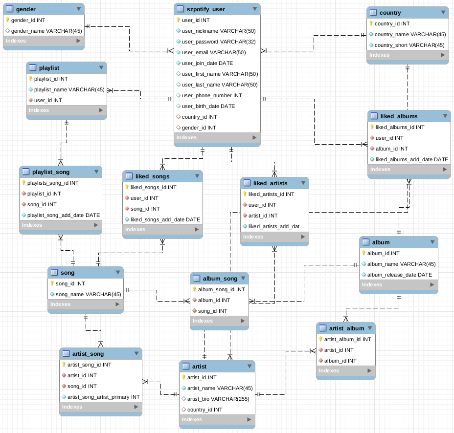

# Serwis muzyczny Szpotify
>Na przedmiocie Bazy Danych zrealizowany został projekt dwuosobowy, którego celem było zaprojektowanie oraz implementacja systemu bazodanowego. 

| Nazwisko i imię | Wydział | Kierunek | Semestr | Grupa | Rok akademicki |
| :-------------: | :-----: | :------: | :-----: | :---: | :------------: |
| Szymon Nowak         | WIMiIP  | IS       |   4     | 3     | 2019/2020      |
| Radosław Niestrój         | WIMiIP  | IS       |   4     | 3    | 2019/2020      |

## Projekt bazy danych
Tematem naszego projektu był "Serwis muzyczny (typu Spotify)" któremu nadaliśmy nazwę **"Szpotify"**. Program w założeniu ma opierać swoją funkcjonalność o powszechnie znany "Spotify". Do wizualizacji bazy danych użytej w projekcie został użyty program **MySQL Workbench**. 



#### Pierwszym krokiem było zaprojektowanie i zaimplementowanie bazy danych
Baza danych została utworzona za pomocą MySQL zawartego w pakiecie Xampp.

Baza danych opiera się na pięciu podstawowych tabelach:
* szpotify_user
* artist
* album
* song
* playlist

Do utworzenia tabeli użyto komendy:

```sql 
CREATE TABLE "table_name" (
    table_name_id int NOT NULL AUTO_INCREMENT,
    ...
    CONSTRAINT table_name_pk PRIMARY KEY (table_name_id),
    CONSTRAINT table_name_second_table_name_fk FOREIGN KEY (second_table_name_id)
    REFERENCES GrupaZ (second_table_name_id)
);
```

Większość połączeń pomiędzy głównymi tabelami została zrealizowana w postaci związków wiele do wielu. Powodem tego był charakter projektu i złożone powiązania pomiędzy tabelami. Dzięki takiej implementacji użytkownik może posiadać wiele polubionych piosenek, jedna piosenka może nalężeć do wielu albumów lub album może posiadać wielu artystów.

#### Drugim krokiem było zaimplementowanie danych do bazy

Do wypełnienia bazy użyto standartowych zapytań MySQL:

```sql
INSERT INTO table_name (column1, column2, ...)
VALUES (value1, value2, ...);
```

#### Ostatnim krokiem było napisanie zapytań do bazy danych, koniecznych do poprawnego działania aplikacji
Złożone zapytanie wylistowania danych z bazy, przykład wypisania polubionych albumów przed danego użytkownika:

```sql
SELECT album.album_name, artist.artist_name FROM liked_albums
INNER JOIN album
ON album.album_id = liked_albums.album_id
INNER JOIN artist_album
ON artist_album.album_id = album.album_id
INNER JOIN artist
ON artist.artist_id = artist_album.artist_id
INNER JOIN szpotify_user
ON szpotify_user.user_id = liked_albums.user_id
WHERE szpotify_user.user_nickname = "Radziu"
```

Dodanie wartości do bazy, przykład dodania nowego użytkownika:

```sql
INSERT INTO szpotify_user (user_nickname, user_password, user_email, user_first_name, user_last_name, user_phone_number, user_birth_date, country_id, gender_id)
VALUES ("Radziu", "Password123", "radoslaw@email.com", "Radosław", "Niestrój", 123123123, "2000-01-13", 1, 2)
```

Usunięcie wartości z bazy, przykład usunię playlisty z bazy:

```sql
DELETE FROM playlist WHERE playlist_name = "Rock & Roll" AND user_id = "1"
```

## Aplikacja
Aplikacja została napisana w języku Python w oparciu o baze danych. Do napisania kodu źródłowego programu użyliśmy środowiska PyCharm. Aplikacja została podzielona na 3 główne pliki. W pliku "menu.py" zostało zaimplementowane menu główne, menu osoby niezalogowanej oraz menu osoby zalogowanej. Menu główne umożliwia zalogowanie się, rejestracje oraz możliwość korzystania bez logowania. Menu osoby zalogowanej udostępnia pełną funkcjonalność serwisu np wyszukiwania piosenki, polubienia, dodania do playlisty itp. Osoba niezalogowana ma możliwość jedynie wyszukania piosenki, artysty, albumu. Plik "szpotify_functions.py" zawiera funkcje wykorzystywane przez plik "menu.py". Ostatnim plikiem jest plik z funkcjami łączącymi aplikacje Szpotify z bazą danych.

Obsługa aplikacji odbywa sie z poziomu terminala. Użytkownik korzysta z serwisu wpisując odpowiednie komendy.

Snippety:
* Menu główne:
    ```py 
    def menu():
    user_input = input(MENU_INTERFACE)
    user_id = 0
    if user_input == 'log':
        user_id = szpotify_functions.log_in()
    elif user_input == 'reg':
        szpotify_functions.register()
        menu()
    elif user_input == 'not':
        not_log_menu()
    elif user_input == 'esc':
        database.close_database()
        sys.exit(0)
    else:
        print("Unknown command! try again.")

 

    if user_id != 0:
        log_menu(user_id)
    else:
        menu()```
        
* Menu zalogowanego użytkownika:
    ```py
    def log_menu(user_id):
    user_input = input(USER_LIBRARY)
    while True:
        if user_input == 'search_s':
            szpotify_functions.search_songs(user_id)
        elif user_input == 'search_a':
            szpotify_functions.search_albums(user_id)
        elif user_input == 'search_ar':
            szpotify_functions.search_artist(user_id)
        elif user_input == 'playlist':
            szpotify_functions.playlist(user_id)
        elif user_input == 'liked_songs':
            szpotify_functions.liked_songs(user_id)
        elif user_input == 'liked_artists':
            szpotify_functions.liked_artists(user_id)
        elif user_input == 'esc':
            menu()
        else:
            print("Unknown command! try again.")

 

        user_input = input(USER_LIBRARY)
        ```


* Menu niezalogowanego użytkownika
    ```py
    def not_log_menu():
    print("When you are not logged in you can only search songs")
    user_input = input(NOT_LOGGED_IN_MENU)
    user_id = 0
    while True:
        if user_input == 'search_s':
            szpotify_functions.search_songs(user_id)
        elif user_input == 'serarch_a':
            szpotify_functions.search_albums(user_id)
        elif user_input == 'search_ar':
            szpotify_functions.search_artist(user_id)
        elif user_input == 'esc':
            menu()
        else:
            print("Unknown command! try again.")

 

        user_input = input(NOT_LOGGED_IN_MENU)
        ```

* Przykładowa funkcja wyszukująca piosenke
    ```py 
        def search_songs(user_id):       #id - user_id
        s_song = input("Enter song name: ")
        correct = False
        song_id = 0
        for song in database.get_all_songs():
            if s_song == song['song_name']:
                correct = True
                song_id = song['song_id']
    
        if correct and user_id != 0:
            print(f"Song \'{s_song}\' has been found in our database")
            song_action(user_id, song_id)
        elif correct and user_id == 0:
            print(f"Song \'{s_song}\' has been found in our database")
        else:
            print("Song that you are looking for doesn't exist in our database")
        
    ```

## Dodatkowe uwagi
Program zspełnia wszystkie wymagania projektu. Rozbudowana baza pomaga w właściwym zarządzaniu zasobami programu.
